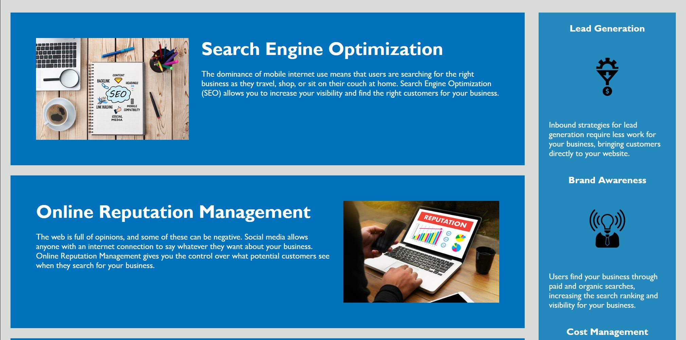
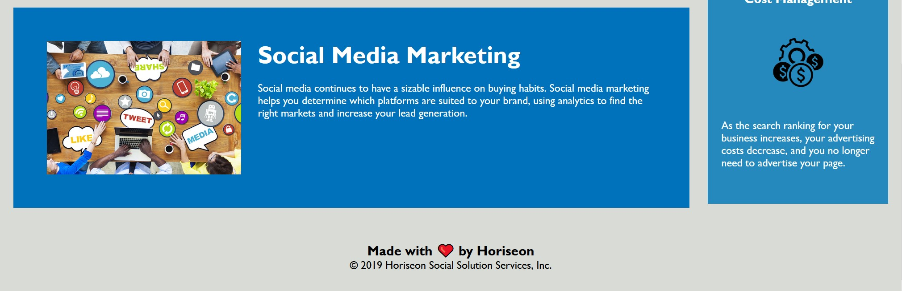

# Code Refactor Starter Code
Module 1 Challenge 1

## Purpose
Clean up existing code by following best practice.

Horiseon website landing page functioned mostly correctly. One id was missing, and was added. CSS was reorganized and consolidated for ease of maintenance. HTML was labelled for ease of maintenance and given proper semantic elements to aid accessibility. Images were given blank alt text to declutter screen readers, since they didn't serve any informative purposes.

## Built With
* HTML
* CSS

## Website
(https://xunvyre.github.io/challenge-one/)

## Screenshots

## Contributors
Xandromus (original code), Xunvyre